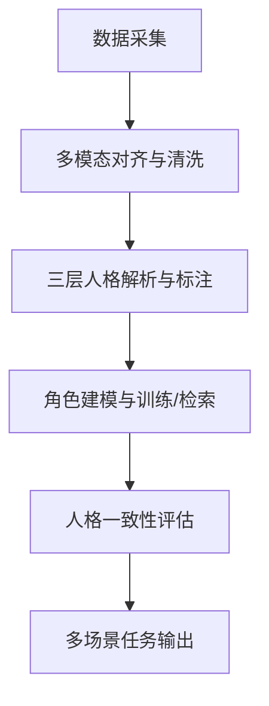

## 🧠 一、研究目标与三层人格结构映射

| 层级      | 描述                   | 示例属性                | 建模目标                      |
| ------- | -------------------- | ------------------- | ------------------------- |
| **稳定层** | 长期稳定、跨情境一致的特质        | Big Five（OCEAN）、价值观 | 通过SFT或LoRA注入角色的稳定人格       |
| **成长层** | 随时间/经历变化，受生活事件塑造     | 知识、经历、信念、记忆         | 通过context embedding模拟成长轨迹 |
| **表现层** | 任务/情境下外显风格，依赖当前目标与语境 | 情绪、风格、语气、立场、口头禅     | 动态控制表达与行为一致性              |

---

## 🧩 二、总体流程与数据形式概览



---

## 🧱 三、每一阶段详细拆解

### 1️⃣ 数据采集阶段（微博为主）

| 内容类型  | 来源         | 数据形式            | 备注                     |
| ----- | ---------- | --------------- | ---------------------- |
| 微博文本 | 用户微博+转发+评论 | JSON（文本+时间+元数据） | 作为主要语料，覆盖长期表达风格与观点     |
| 图片/视频 | 微博媒体文件     | URL/本地路径 + 元数据  | 通过VLM提取场景/物体/情绪/事件线索 |
| 头条文章 | 文章链接/正文     | 长文本 + 元数据       | 提升稳定层与成长层证据密度         |

---

### 2️⃣ 三层人格解析与标注（面向单帖与全局）

**核心约束**：所有抽取均需提供“证据片段”与“置信度”；不对私人身份属性或医疗/健康状态做推断；观点和意图只从文本与视觉线索中归纳，不做事实断言。

#### 📌 稳定层（Stable Traits）

* **目标**：确定角色的 Big Five 排序、价值观与长期偏好倾向
* **方法**：

  * 使用 GPT + BFI-44/NEO prompt 推理
  * 引入人工校验标注（10% 样本双人交叉）
* **数据形式**（JSON Schema）：

```json
{
  "trait": {
    "openness": 0.85,
    "conscientiousness": 0.40,
    "extraversion": 0.30,
    "agreeableness": 0.20,
    "neuroticism": 0.60
  },
  "political_leaning": "unknown_or_not_inferred",
  "values": ["aesthetics", "independence", "craftsmanship"]
}
```

#### 📌 成长层（Developmental Layer）

* **目标**：解析出长期生活事件与偏好/信念的变化轨迹
* **方法**：

  * 事件模板抽取（如“婚姻”“竞选失败”）
  * belief/knowledge tracing（LLM标注+人工确认）
* **数据形式**：

```json
{
  "event": "毕业/搬迁/工作转变/合作品牌",
  "belief_change": {
    "before": "偏好清爽简约风",
    "after": "偏好奶油风/法式复古风"
  },
  "time": "2020-11"
}
```

#### 📌 表现层（Expressive Layer）

* **目标**：抽取风格、语气、情绪倾向、口头禅、标志性句式
* **方法**：

  * style tagger（语气词识别）
  * LLM情绪分类 + 人工打标签修正
* **数据形式**：

```json
{
  "utterance": "我太爱这个小角落了…",
  "style": ["warm", "detailed", "life-aesthetic"],
  "emotion": "positive",
  "stance": "supportive_of_home_decor"
}
```

---

### 3️⃣ 角色建模与训练方式

| 层级  | 建模方式                 | 训练数据类型                   | 是否需人工参与        |
| --- | -------------------- | ------------------------ | -------------- |
| 稳定层 | Full SFT / LoRA人格建模  | Trait-labeled文本 + 角色语料   | ✅ 标签需人工复核      |
| 成长层 | Contextual Injection | Prompt编排 + Time-tagged事件 | ⚠️ prompt需人工设计 |
| 表现层 | Activation/Adapter调控 | 多风格片段 + 模拟事件输入           | ✅ 风格模板需人工参与    |

---

### 4️⃣ 评估机制与输出任务

#### 🌐 输出任务类型

| 类型   | 输入形式    | 预期输出      | 评估点              |
| ---- | ------- | --------- | ---------------- |
| 播客文章 | 主题 + 背景 | 500字意见类陈述 | 表现风格/立场是否一致      |
| 访谈对话 | 采访问题    | 多轮回应      | 情绪一致性 + 回答是否符合角色 |
| 推文/微博模拟 | 事件描述    | 角色短文本 | 情绪、立场、语言风格       |
| 多轮对话 | 用户提问    | 连贯角色式对答   | 语气情绪连贯性 + 观点稳定性  |

#### 🎯 评估机制设计

* 自动指标：

  * 人格特征匹配度（如与之前标注的人格分布对比 KL散度）
  * 文本风格相似度（embedding + stylistic classifier）
  * 观点/立场一致率（如与历史推文情感一致性）

* 人工评估：

  * 任务维度打分（风格真实度、行为一致性、人格可信度等 1-5 Likert Scale）
  * 锚定式打分（参考真实样本 vs. 模拟样本）

---

## 🧭 四、面向微博/VLM的单帖分析目标

对 @weibo 下每条微博（文本+图片+视频）进行结构化抽取，目标包括：

1) **发推风格**：口头禅、标志性句式、语气特征、常见语义模板  
2) **禁忌清单/敏感词替换**：不是“不能说”，而是“说到时替换为的表达”  
3) **立场/观点/意图**：对具体对象的态度与背后意图（仅基于文本与视觉线索）  
4) **事物/事件/场景**：一句话概括“因为什么而发帖/针对什么而说”  
5) **知识库**：关于帖主的经历、喜欢/讨厌、掌握的知识点（只提取事物与事件）

每条抽取都要给出 **证据片段** 与 **置信度**。

## 🧱 五、VLM驱动的多模态抽取流程

1) **媒体解析**：对图片/视频进行帧抽取与VLM标注  
2) **多模态对齐**：将视觉线索与文本时间线对齐（同一微博为最小单位）  
3) **单帖抽取**：从文本+视觉线索生成结构化结果  
4) **跨帖归纳**：合并去重，形成稳定层/成长层/表现层统计  

## 🗂️ 六、数据结构设计（建议 Schema）

### 1) 原始数据表

```json
{
  "post_id": "string",
  "user_id": "string",
  "created_at": "ISO8601",
  "text": "string",
  "media": [
    {"type": "image|video", "path": "string", "url": "string"}
  ],
  "stats": {"like": 0, "comment": 0, "repost": 0},
  "source": "string"
}
```

### 2) 单帖抽取结果

```json
{
  "post_id": "string",
  "style": {
    "catchphrases": ["string"],
    "signature_patterns": ["string"],
    "tone": ["warm", "detailed"],
    "emotion": "positive|neutral|negative",
    "evidence": ["text span or visual cue"],
    "confidence": 0.0
  },
  "safety_rewrite": {
    "terms": [{"term": "string", "replacement": "string"}],
    "evidence": ["text span"],
    "confidence": 0.0
  },
  "stance": [
    {
      "target": "string",
      "position": "support|oppose|neutral",
      "reason": "string",
      "intent": "string",
      "evidence": ["text span or visual cue"],
      "confidence": 0.0
    }
  ],
  "topic": {
    "trigger": "string",
    "one_sentence_summary": "string",
    "evidence": ["text span or visual cue"],
    "confidence": 0.0
  },
  "knowledge_facts": [
    {"fact": "string", "evidence": ["text span"], "confidence": 0.0}
  ]
}
```

### 3) 跨帖归纳结果（角色层）

```json
{
  "persona_id": "string",
  "stable_traits": {
    "big_five": {"o": 0.0, "c": 0.0, "e": 0.0, "a": 0.0, "n": 0.0},
    "values": ["string"],
    "confidence": 0.0,
    "evidence_posts": ["post_id"]
  },
  "developmental_events": [
    {
      "event": "string",
      "time": "YYYY-MM",
      "impact": "string",
      "evidence_posts": ["post_id"],
      "confidence": 0.0
    }
  ],
  "expressive_profile": {
    "preferred_tone": ["string"],
    "catchphrases": ["string"],
    "signature_patterns": ["string"],
    "sensitive_replacements": [{"term": "string", "replacement": "string"}],
    "confidence": 0.0
  }
}
```

### 4) 向量索引（用于检索一致性）

```json
{
  "item_id": "post_id|fact_id",
  "embedding": "vector",
  "tags": ["style", "stance", "topic"]
}
```

## 🧪 七、评估与一致性检查

* **单帖一致性**：抽取结果是否与文本/视觉证据一致  
* **跨帖一致性**：同类场景下风格是否稳定  
* **冲突检测**：观点/偏好是否出现突变（需标注为“可能变化”）

## 📌 总结：人工与自动协同的关键点

| 阶段     | 是否需人工参与    | 理由                         |
| ------ | ---------- | -------------------------- |
| 稳定层标注  | ✅ 必需       | LLM可能存在人格漂移或自我矛盾           |
| 成长层构建  | ⚠️ 局部需人工设计 | 时间线构建、belief shift表述需要语义精确 |
| 表现层校验  | ✅ 部分必要     | 情绪与语气标签仍不稳定，需人工复核          |
| 输出结果评估 | ✅ 重要任务需人工  | 多模态表达一致性难以自动衡量             |
